<picture>
  
</picture>

- 🔭 [Kubernetes][kubernetes] Steering Committee Member and Maintainer.
- 💼 Staff Software Engineer at [VMware Tanzu][vmware-tanzu] building highly scalable multi-tenant control planes.
- 💬 Ask me about Kubernetes, Go, Python, Devops and Open Source.
- 🌱 I’m currently building my own personal finance stack.
- 😄 Pronouns: he/him
- ⚡ Fun fact: I am usually the coffee and mechanical keyboards guy in the group.
- 📫 Reach out to me on [Twitter](https://twitter.com/theonlynabarun).

<picture>
  
</picture>

<picture>
  
</picture>

<picture>
  
</picture>

[vmware-tanzu]: //tanzu.vmware.com
[kubernetes]: //kubernetes.io
[iitr]: //iitr.ac.in

<!--
# TODO
- Setup Page
- Current work Page
- Kubernetes Work page
-->
